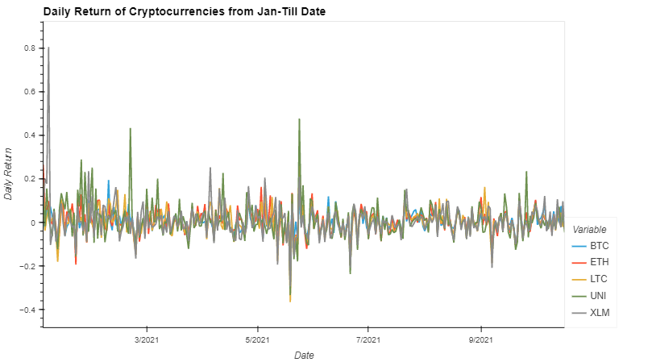
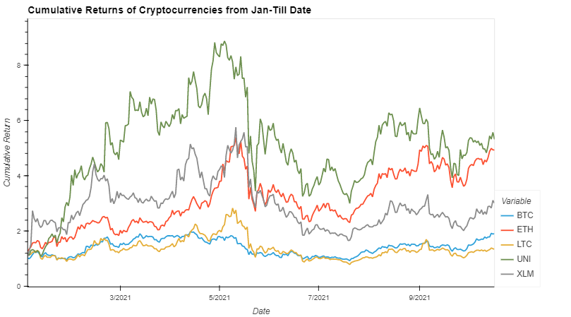

# UWFinTech_Group3_Project1

## Crypto Trend Analysis And Predictions

This project is designed for quantitative analysis used in FinTech investing platform. This project aims to offer clients a one-stop online investment solution for the customer's portfolios. The code and analysis of different graphs and visualization helps in determining whether the cryptocurrencies with the most investment potential based on key risk-management metrics: the daily returns, cummulative Returns, standard deviations, Sharpe ratios.

We have also developed an application that works through CLI which gives information about the cumulative return percentage, Standard Deviation and Sharpe ratios from the beginning of 2021 to till date as an indicator of the risk associated with investing in each one of them. The application is designed to takes the two cryptocurrencies from the user as investment options, the amount of investment and the share of each cryptocurrency in the portfolio of the investment, based on those informations the Monte Carlo simulation is programmed to provide returns and the range of the prospect of investing in those coins after three years.

The list of the coins that the user can choose from is : Bitcoin (BTC), Ethereum (ETH), Litcoin (LTC), Uniswap (UNI), and Steller (XLM)

---

## Technologies Used

Leveraging Jupyter Notebook, Python 3.5+.
Leveraging the use of Pandas which is included in Anaconda.
Please go to: https://docs.anaconda.com/anaconda/install/ - For finding the proper installation guide.
The packages will be:
Gitbash CLI is used to pull and push the code from local repository to remote repository (GitHub).
Code written with the help of Jupyter Notebook and VSCode


---

## Libraries and Dependencies

import pandas as pd
import datetime
import numpy as np
import cbpro
import csv
import questionary
import hvplot.pandas
from MCForecastTools import MCSimulation

%matplotlib inline

 
* [questionary](https://github.com/tmbo/questionary) - For interactive user prompts and dialogs
* [pandas](https://github.com/pandas-dev/pandas)- For information and documentation
* [Numpy](https://github.com/AhmetFurkanDEMIR/Numpy)- For information on the library and insights


---

## Installation Guide
Aside from installation of Anaconda, We need to install questionary and then import its library.

`pip install questionary`

Coinbase Pro installation:

```pip install cbpro
#or

pip install git+git://github.com/danpaquin/coinbasepro-python.git
```
---

## Analysis 

To analyse the data first import the current data from coinbase pro and prepare your daily returns DataFrame for analysis. 

Example for fetching Bitcoin crypto from coinbase pro:

### Step1: (Initialize the client and fetch historical Data)

Initialize the client, obtain our products data, and put it into a pandas data frame for better observation: 
#import cbpro import pandas as pd c = cbpro.PublicClient()

fetching historical data from cbpro:

```
btc_df = pd.DataFrame(c.get_product_historic_rates('BTC-USD', start = '2021-01-01T01:00:00', end = date.today(), granularity = 86400))
btc_df.columns = ["Date","Open","High","Low","Close","Volume"]
btc_df['Date'] = pd.to_datetime(btc_df['Date'], unit='s')
btc_df.set_index('Date', inplace=True)
btc_df.sort_values(by='Date', ascending=True, inplace=True)
btc_df
```

### Step 2: (Slice Data and concat the dataframes)
After fetching all the required historical concat all the dataframes into one dataframe and drop all the columns except the "Close" column for further analysis:

```
btc_sliced = btc_df.loc[:, 'Close']
display(btc_sliced.head())
eth_sliced = eth_df.loc[:, 'Close']
display(eth_sliced.head())
ltc_sliced = ltc_df.loc[:, 'Close']
display(ltc_sliced.head())
uni_sliced = uni_df.loc[:, 'Close']
display(uni_sliced.head())
xlm_sliced = xlm_df.loc[:, 'Close']
```

```
crypto_portfolio_df = pd.concat([btc_sliced, eth_sliced, ltc_sliced, uni_sliced, xlm_sliced], axis=1)
crypto_portfolio_df.columns = ['BTC', 'ETH', 'LTC', 'UNI', 'XLM']
```

### Step3: (Performance Analysis:)

Prepare for the analysis by converting the dataframe of closing prices to daily returns
Drop any rows with all missing values
Review the first five rows of the daily returns DataFrame.


```
crypto_daily_returns = crypto_portfolio_df.pct_change().dropna()
crypto_daily_returns.head()
```

### Step4: (Volatility Analysis & Risk-Return Ratio:)


Calculate and plot the cumulative returns of the 5 cryptocurrencies
Review the last 5 rows of the cumulative returns DataFrame

```crypto_cumulative_returns = (1 + crypto_daily_returns).cumprod()```

Calculate and sort the standard deviation for all 5 crypto portfolios.
Review the standard deviations sorted smallest to largest

```crypto_std_df = crypto_daily_returns.std().sort_values()```

Calculate and sort the annualized standard deviation (calculate the trading days) of the 5 currencies
Review the annual standard deviations smallest to largest
Trading Days 01-01-2021 - current date 

```
trading_days = crypto_daily_returns.count()[1]+1
print(f"The Trading days are: {trading_days}")
crypto_annual_std = crypto_std_df * np.sqrt(trading_days)
crypto_annual_std.sort_values()
```

Calculate the annual average return data for the for all the current crypto currencies.
Review the annual average returns sorted from lowest to highest
Trading Days 01-01-2021 - till current's date.
Use the Pandas mean function to calculate the average daily return for 5 cryptocurrencies.

```annual_average_return = crypto_daily_returns.mean() * trading_days```

Sort the annual average returns from lowest to highest

```annual_average_return.sort_values()```

Calculate the annualized Sharpe Ratios for all the cryptocurrencies.
Review the Sharpe ratios sorted lowest to highest

```
sharpe_ratio = annual_average_return / crypto_annual_std
sharpe_ratio.sort_values()
```

Then, you’ll do a quantitative analysis that includes the following:


## Usage

In order to see the graphs of the analysis go to the "Images" folder of the repository and find the Cumulative Return, the Daily Return and the comparative Sharpe Ratio plots of all the five cryptocurrencies.

### CLI Application Usage:

The application is designed to interact with customer and dynamically get the data and simulate the operation and give a outlook of the profit and loss margin based on 95% confidence level. CLI-project_1 is the python file written for the application to run on CLI interface.

To run the app, clone the repository on your PC, open Git Bash in the cloned folder and then type:
```console
    python CLI-project_1
```
You will see some information on the cumulative return of the 5 cryptocurrencies and their Sharpe ratios.
Step1: The program will ask you to choose two of them. 

Step2: In the next step, you will need to enter the amount of investment

Step3: You will determine the structure of your portfolio. The program will ask your confirmation of the information.

Step4: The application will start simulating the historical data of the prices of these coins over the next three years and based on that, provides some insight on the amount of potential profit of this investment.

### Simulation Code:

NOTE: Need to import MCSimulation from MCForecastTools, which program is written for simulating portfolio of customer for 500 simulaions.

---

Image Snippets:

  
  


## Contributors

This project is designed by - 

- Swati Subhadarshini  
Emaid id: sereneswati@gmail.com  
LinkedIn link: www.linkedin.com/in/swati-subhadarshini  

- Somaye Nargesi  
Email address:srn1358@gmail.com  

- Jansen Eichenlaub  

